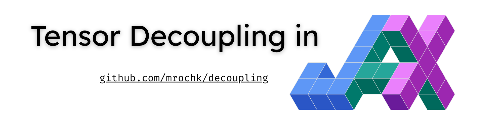

# Decoupling

**Fast tensor decoupling in Jax.**

Tensor decoupling is a methodology for decoupling multivariate functions using tensor decompositions.

```python
import jax, jax.numpy as jnp
from decoupling import Algorithm
from decoupling.utils import collect_information_from_random, function_error

def target(x): # define a simple polynomial
    return jnp.array([x[0]**3 + x[1]**2 + x[0]*x[1], x[1]**3 + x[0]**2 + x[0]*x[1]])

key = jax.random.key(0)
rank = 4; niters = 50; dof = 10

# collect information (inputs, outputs, jacobians)
info = collect_information_from_random(target, N=100, key=key, ninputs=2)

decoupling = Algorithm(rank, niters, dof, key).run(*info) # compute decoupling
print(function_error(target, decoupling, info[0])) # compare to target
```

This project was built using `uv` (https://docs.astral.sh/uv). 

### Installation

You can easily get `decoupling` from PyPI:
```bash
pip install decoupling
```
Otherwise, for a local installation:
```bash
git clone git@github.com:mrochk/decoupling.git
pip install decoupling
```

### Methodology

Tensor decoupling algorithms are used to find a decoupled representation of a target multivariate function. This is illustrated below.

<p align="center">

</p>

In fact, this representation is a 2-layer MLP, meaning that tensor decoupling could be used to compress or build neural networks.

You can read about the basic methodology in this paper: https://arxiv.org/abs/1410.4060.

The goal of this library is to be the reference implementation of tensor decoupling algorithms. Our goal is to keep the source code as simple as possible, while being fast by leveraging Jax's JIT compiler, and, later, GPUs. 

The other important aspect is that it should be easy to design and add new algorithms, by leveraging already written and reusable code.

### Testing

```bash
uv run python -m pytest -s # or ./test.sh
```
